# TalentSphere Ecosystem — Hierarchical Tree Flowchart

Below is the tree-structured hierarchical flowchart of the **TalentSphere Multi-Agent System**.

---

## 🌲 Interactive Mermaid Tree Flowchart

```mermaid
graph TD
    ROOT["TalentSphere Enterprise Ecosystem"]

    %% Level 1 Branches
    ROOT --> GW["1. FastAPI Backend Core Gateway"]
    ROOT --> LG["2. LangGraph Master Supervisor Engine"]
    ROOT --> DB["3. PostgreSQL 17 & pgvector Infrastructure"]

    %% Gateway Sub-nodes
    GW --> GW1["JWT Auth & Security"]
    GW --> GW2["Tenant Context Manager (organization_id)"]
    GW --> GW3["Async REST Router"]
    GW --> GW4["WebSocket Event Hub"]

    %% LangGraph Core Sub-nodes
    LG --> LG1["PostgresSaver State Checkpointer"]
    LG --> LG2["Human-in-the-Loop Interrupt Controller"]
    LG --> LG3["Domain Subgraph Ecosystem (~60 AI Agents)"]

    %% DB Sub-nodes
    DB --> DB1["10 Domain Modules (291 Tables)"]
    DB --> DB2["pgvector Extension (VECTOR 1536)"]
    DB --> DB3["Audit Trails & Soft Deletes"]

    %% Domain Subgraphs
    LG3 --> SG1["A. Sourcing & JD Subgraph (8 Agents)"]
    LG3 --> SG2["B. Screening & Match Subgraph (12 Agents)"]
    LG3 --> SG3["C. Interview & Assessment Subgraph (10 Agents)"]
    LG3 --> SG4["D. Offer & Onboarding Subgraph (6 Agents)"]

    %% Agents under Sourcing
    SG1 --> AG11["JD Generator Agent"]
    SG1 --> AG12["SEO & Keyword Optimizer Agent"]
    SG1 --> AG13["Multi-Board Job Publisher Agent"]

    %% Agents under Screening
    SG2 --> AG21["Resume Parser Agent"]
    SG2 --> AG22["Vector Embedding Matcher (1536d)"]
    SG2 --> AG23["Bias Detector & Compliance Agent"]
    SG2 --> AG24["Candidate Ranker Agent"]

    %% Agents under Interviews
    SG3 --> AG31["Assessment Question Generator Agent"]
    SG3 --> AG32["Coding Test Evaluator Agent"]
    SG3 --> AG33["Transcript Sentiment Analyzer Agent"]
    SG3 --> AG34["Behavioral Scorecard Generator Agent"]

    %% Agents under Offers
    SG4 --> AG41["Salary Band & Comp Benchmark Agent"]
    SG4 --> AG42["Offer Letter Drafting Agent"]
    SG4 --> AG43["BGV & Document Verification Agent"]
    SG4 --> AG44["Employee Conversion Agent"]
```

---

## 📊 Hierarchy Breakdown

| Node Level | Component | Role / Responsibility |
|---|---|---|
| **Root** | `TalentSphere Enterprise Ecosystem` | Top-level system container |
| **Level 1** | `FastAPI Core Gateway` | API Routing, Session Authentication, Tenant Context Injection |
| **Level 1** | `LangGraph Master Supervisor` | Graph State Management, Subgraph Delegation, Human Interrupts |
| **Level 1** | `PostgreSQL 17 & pgvector` | Multi-tenant persistent storage, Vector Similarity Search |
| **Level 2** | `Domain Subgraphs` | 4 Modular Domain Clusters grouping ~60 specialized agents |
| **Level 3** | `Specialized AI Agents` | Autonomous worker agents (JD Generator, Resume Parser, Vector Matcher, etc.) |
